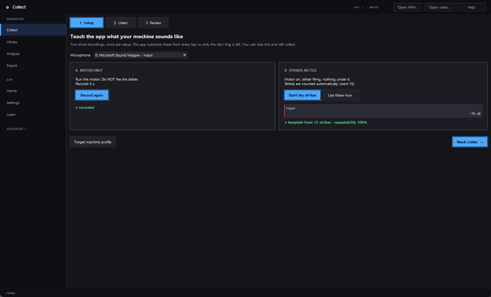
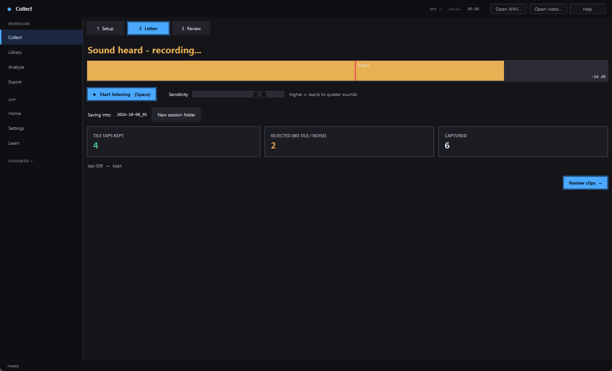
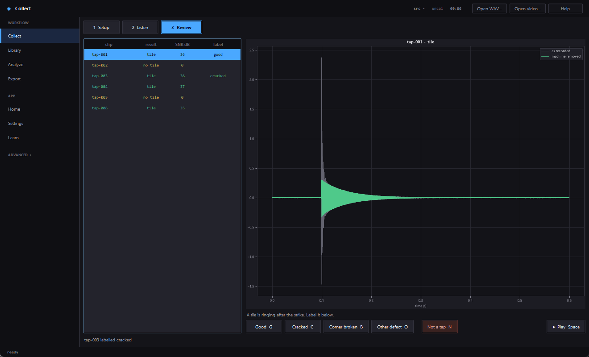
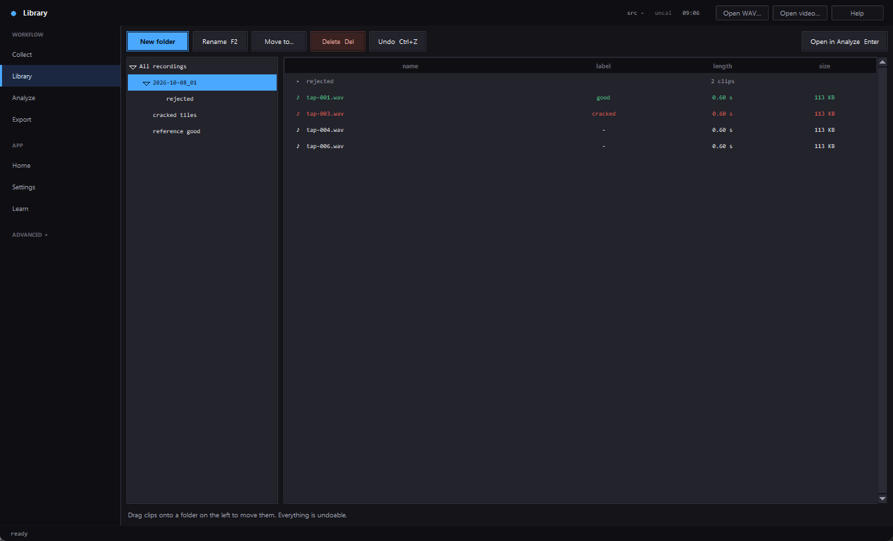
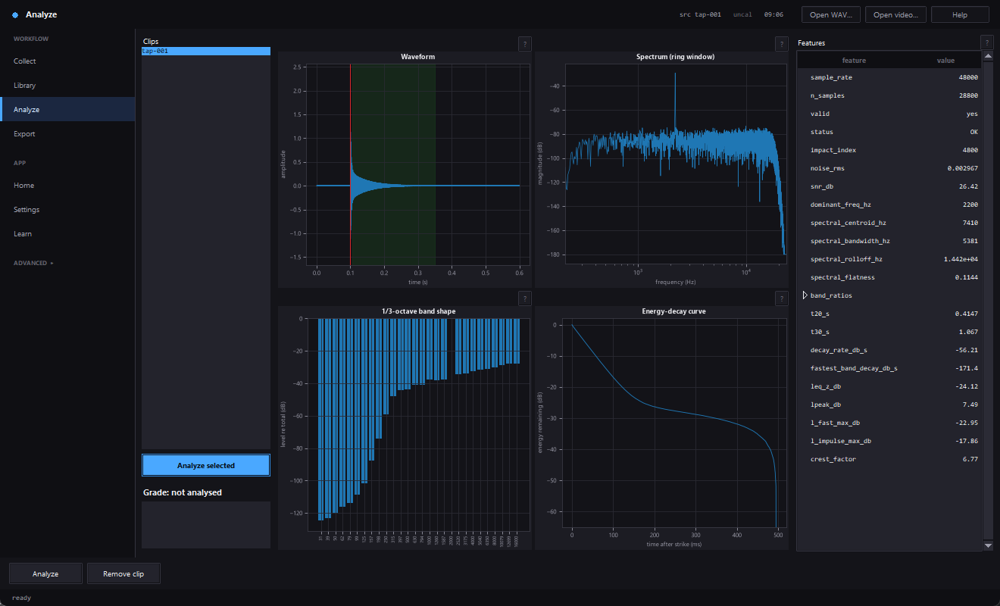
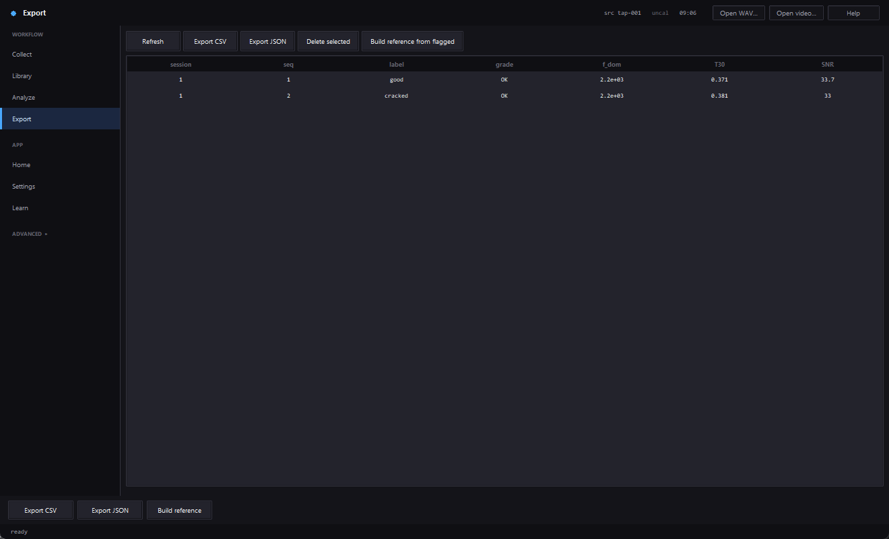
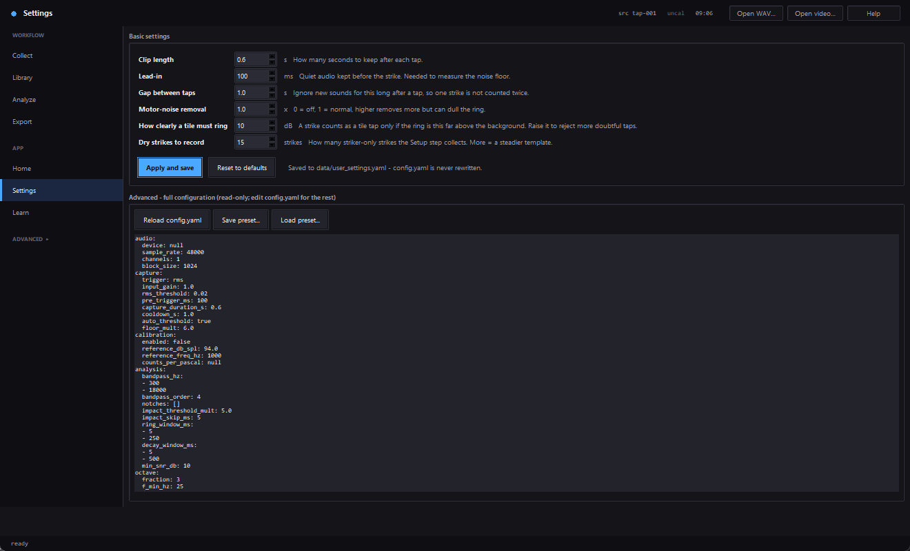

# Acoustic-Analysis

A desktop workbench for **collecting, cleaning, analysing and labelling tap-test sound** —
tap a tile with a striker, let the app record each strike automatically, strip out the
sound of your own machine, label what is left, and export a dataset for training a
classifier.

Built for **acoustic non-destructive testing** — striking an object with a repeatable
impact and reading its ringing response to tell a sound part from a cracked one. The
first use case is clay/ceramic roofing tiles, but nothing in the analysis is
tile-specific.

> **Status: v0.3, working end to end on synthetic and generated data.** New in v0.3: a
> guided **Collect** screen (sound-triggered capture + machine-noise removal), a
> **Library** file manager, a simplified sidebar and plain-language **Basic settings**.
> 237 tests pass. **Not yet done:** it has never run against a real microphone or the
> real striker rig, no pistonphone calibration, every threshold in `config.yaml` is
> provisional until tuned on real tiles. See [`TODO.md`](TODO.md).

> Part of the **Tile Sorting** automated inspection project (VIT Chennai,
> BMEE497J/BMHA497J). This repo is deliberately standalone and reusable — the tile line
> consumes only the *exported dataset* and the *model trained from it*, never this app's
> code directly.

**Contents:** [Install](#install) · [Step-by-step guide](#step-by-step-guide) ·
[How machine-noise removal works](#how-machine-noise-removal-works) ·
[Troubleshooting](#troubleshooting) · [Features](#features) · [Project layout](#project-layout)

---

## Install

Windows 10/11, Python 3.13+, and a microphone.

```powershell
git clone https://github.com/KL-Mithunvel/Acoustic-Analysis.git
cd Acoustic-Analysis
python main.py          # first run builds ./venv, installs dependencies, opens the app
```

Or manage the environment yourself:

```powershell
python -m venv venv
venv\Scripts\activate
pip install -r requirements.txt
python -m acoustic_analysis
```

Run the tests with `python -m pytest -q`.

> **Before you record anything:** turn off Windows microphone *Enhancements* (automatic
> gain, noise suppression). Sound Control Panel → *Recording* → your mic → *Properties* →
> *Enhancements* → disable. Python cannot do this for you, and with them on, levels and
> spectra are not trustworthy.

---

## Step-by-step guide

The screenshots below are taken from the real app running on **synthetic demo data**
(regenerate them with `python tools/make_screenshots.py`). Your waveforms will differ.

The sidebar has four everyday screens — **Collect, Library, Analyze, Export** — plus
**Home, Settings, Learn**. Everything else is folded under **ADVANCED** (click it to open).
The app opens on **Collect**.

The shape of a collecting session:

```text
 Setup (once)  →  Listen (strike tiles)  →  Review (label)  →  Export
 record the        sound triggers each       one key per         CSV / JSON
 machine's noise   capture automatically     clip                dataset
```

### 1. Setup — teach the app what your machine sounds like



Your rig makes noise of its own: the motor hums, and the striker clicks and rattles even
when it hits nothing. Two short recordings let the app subtract both from every tap. You
only repeat them if the rig changes (different motor speed, striker moved, new room).

1. **Pick your microphone** from the *Microphone* list. If unsure, run
   `python -m acoustic_analysis.cli devices` to see them.
2. **A — Motor only.** Start the motor, keep the striker still, click **Record motor
   noise**. It records 5 seconds and shows **● recorded**.
3. **B — Striker, no tile.** Start the motor *and* the striker, with **nothing under the
   striker**, and click **Start dry strikes**. The app counts strikes by sound as they
   happen ("7 / 15 strikes heard") and builds the template itself when it has enough, or
   click **Use these now** to stop early (it needs at least 5).
4. Read the result: **● template from 15 strikes — repeatability 96%**.
   - **80% or higher** (green) — the striker sounds the same every time; the template is
     trustworthy.
   - **Below 80%** (amber) — strikes differ too much, so subtracting would leave
     artefacts. Check the striker is fixed firmly and the ball lands the same way, then
     record again.
5. Click **Next: Listen**.

Setup is **optional**. Without it you still capture and save clips, but nothing is
subtracted and the automatic "no tile" sort cannot work (a striker click then looks like
a tile ring).

Your settings are saved in `data/machine_profile.npz` and reloaded next time. **Forget
machine profile** deletes them.

### 2. Listen — strike tiles, the app does the rest



1. Click **▶ Start listening** (or press **Space**). The status reads *Getting ready…
   stay quiet for a moment* for about half a second while the app learns the background
   level, then *Listening — strike a tile*.
2. Put a tile under the striker and let it fire. You don't press anything per tap: the
   app **triggers on sound**, whatever fires the striker.
3. Watch the **level bar**. The red line is the trigger level. When sound crosses it the
   bar turns amber and the status says *Sound heard — recording…*.
4. Each capture is cleaned and filed automatically:

   | Counter | Meaning |
   |---|---|
   | **Tile taps kept** | a tile is ringing after the strike — saved in the session folder |
   | **Rejected** | only the machine is left (no tile under it) or no strike was found — saved in `rejected/` |
   | **Captured** | everything the trigger heard |

5. **Sensitivity** — drag right if real taps are being missed (reacts to quieter sounds);
   drag left if the motor or room noise is triggering captures. The trigger already
   follows the background level, so this rarely needs touching.
6. Files go to a dated session folder such as `2026-10-08_01`. **New session folder**
   starts a fresh one (a new batch of tiles, say).
7. Click **Stop** (or **Space**) when you're done, then **Review clips →**.

Nothing is ever thrown away: the untouched recording of every capture is kept in a hidden
`.raw` folder inside the session, so a wrong cleaning decision can be redone.

### 3. Review — label with one key



The list shows every capture this session, coloured by what the app decided
(green = tile, amber = no tile, grey = no strike). The chart overlays **as recorded**
(grey) on **machine removed** (green) — you can see the striker's click vanish while the
tile's ring stays.

Click a clip, then press a key. It saves the label, adds the clip and its measurements to
the dataset, and **jumps to the next clip**:

| Key | Label |
|---|---|
| **G** | good |
| **C** | cracked |
| **B** | corner broken |
| **O** | other defect |
| **N** | *not a tap* — moves the clip into `rejected/` |
| **Space** | play the clip |

The app's tile / no-tile decision is a **suggestion**: you always have the last word, and
anything in `rejected/` can be moved back from the Library.

### 4. Library — rename, create folders, move things



The Library is a file manager for your recordings. The folders are **real folders on
disk** (under `data/recordings/`), so Windows Explorer sees the same tree — but use the
Library for renames and moves, because it also keeps each clip's `.json` sidecar and its
database entry in step, which Explorer would not.

| To… | Do this |
|---|---|
| open a folder | click it in the left tree, or double-click it in the list |
| make a folder | **New folder** (made inside the folder you're viewing) |
| rename | select it, **Rename** or **F2**. Typing `tile7` keeps the `.wav` |
| move | drag clips onto a folder in the left tree, or **Move to…** |
| delete | select, **Delete** or **Del** — goes to a hidden trash, nothing is erased |
| undo | **Undo** or **Ctrl+Z** — reverses the last move, rename, delete or new folder |
| analyse a clip | select, **Open in Analyze** or **Enter** |

Labelled clips are colour-coded (green = good, red = defect). The library will **refuse**
rather than overwrite: a name that already exists is an error, never a silent replace.
Recently deleted files stay in `data/recordings/.trash` until you empty it.

### 5. Analyze — look at one clip in detail



Pick a clip on the left (or send one over from the Library) and click **Analyze
selected**. You get the waveform with the detected strike and ring window, the spectrum,
the 1/3-octave band shape, the energy-decay curve, and every measured feature in the
table on the right. Each chart has a **?** that explains what it shows.

### 6. Export — build the dataset



Every clip you labelled appears here with its label and key measurements.

- **Export CSV / Export JSON** — the labelled feature dataset for training a classifier.
- **Delete selected** — remove a row from the dataset (the audio file stays).
- **Build reference from flagged** — builds the grading reference from clips flagged "add
  to reference set" (flag them on the **Label** screen under ADVANCED).

### 7. Settings — the few values worth changing



**Basic settings** are in plain language: clip length, lead-in, gap between taps,
motor-noise removal strength, how clearly a tile must ring to count as a tap, and how
many dry strikes to record. Change a value and click **Apply and save**; **Reset to
defaults** undoes it.

They are saved to `data/user_settings.yaml` and layered over `config.yaml`, which is
**never rewritten** (so its explanatory comments stay). The full configuration is shown
below as read-only text; edit `config.yaml` directly for anything not listed.

### Shortcuts

| Key | Where | Does |
|---|---|---|
| Space | Collect → Listen | start / stop listening |
| G · C · B · O · N | Collect → Review | label / not-a-tap, then next clip |
| Space | Collect → Review | play clip |
| F2 · Del · Ctrl+Z · Enter | Library | rename · delete · undo · open in Analyze |
| Ctrl+O | anywhere | open WAV file(s) |
| Esc | anywhere | back to the previous screen |
| Ctrl+PageUp / PageDown | anywhere | previous / next screen |

---

## How machine-noise removal works

The motor and the striker are *different kinds* of noise, so they are removed differently.

- **Motor hum is steady**, so it is removed with a *spectral profile*: the average sound
  of the motor alone (Setup step A) is subtracted from every capture.
- **The striker without a tile is short, sharp and repeatable** — the solenoid click and
  rattle sound nearly the same every cycle. A spectral profile handles that badly, so the
  app builds a **time-domain template**: it lines up every dry strike on its onset and
  averages them (Setup step B). What repeats (the striker) survives averaging; what
  doesn't (motor, room) cancels out. For each real strike, the template is lined up with
  the click (searching ±2 ms) and subtracted, leaving the tile's own ring.
- **Is there a tile at all?** If almost nothing is left after subtraction, the strike had
  no tile under it, and the clip goes to `rejected/`. That doubles as a noise-versus-tap
  check.
- **The trigger** follows the background level (6× the running noise floor by default),
  so a loud motor raises the trigger instead of firing it constantly. It is independent of
  the striker — it just listens.

Limits worth knowing: the subtraction only works if the striker is repeatable, which is
why the **repeatability score** exists. The solenoid click overlaps the first
milliseconds of the tile's ring, so those milliseconds are the least clean. And **every
threshold here is provisional** — it has been tested on synthetic rigs with known
answers, not on your real machine. Expect to adjust *Sensitivity* and *How clearly a tile
must ring* on the first real session.

---

## Troubleshooting

| Symptom | Likely cause and fix |
|---|---|
| Nothing is captured | Sensitivity too low, or wrong microphone. Check the level bar moves when you clap; raise **Sensitivity**. |
| Constant captures with no striker | Background is loud or fluctuating. Lower **Sensitivity**; check the motor mount isn't vibrating the mic stand. |
| Real taps land in `rejected/` | The tile ring is quiet compared with the machine. Lower **How clearly a tile must ring** in Settings; make sure Setup B was done with the motor *on*. |
| Dry strikes land in the tile folder | Setup B wasn't done (no template), or repeatability was low. Redo Setup B and check it shows 80%+. |
| Repeatability is low | Striker or ball moves between strikes. Fix the mounting and ball landing spot, then record again. |
| Levels look wrong or jump around | Windows microphone *Enhancements* (AGC) are on — turn them off (see Install). |
| "Could not open the microphone" | Another program has it, or the device index is wrong. Close other recorders and re-pick the device. |
| Clips cut off the end of the ring | Raise **Clip length** in Settings. |
| A clip is in the Library but not in Export | Only clips you have **labelled** are added to the dataset. Label it in Collect → Review (or the Label screen). |
| Clips moved in Explorer lose their dataset entry | The Library updates the database path on every move; Explorer can't. Move them back, or move them with the Library. |

---

## Features

- **Collect** — guided Setup / Listen / Review flow; sound-triggered capture with an
  adaptive threshold; motor-spectrum and striker-template removal; automatic tile / no-tile
  sort; raw audio always kept; one-key labelling.
- **Library** — folder tree on disk with create / rename / move / drag-and-drop / delete
  and undo; keeps WAV, sidecar and database in step; never overwrites.
- **Slice a video** *(ADVANCED)* — open tap-test footage, see its audio as a waveform, and
  cut it into one labelled snippet per strike. **Find strikes** pre-cuts a snippet around
  each; you confirm, adjust and label. Requires `ffmpeg` — supplied by the
  `imageio-ffmpeg` dependency.
- **Analysis suite** (see [`docs/METHODS.md`](docs/METHODS.md)): fractional-octave bands
  (IEC 61260), FFT spectrum and descriptors, Schroeder decay (T20 / T30, per-band decay),
  level metrics (Leq, Lpeak, Fast/Slow/Impulse, Ln), A / C / Z weighting (IEC 61672).
- **Compare / Filters / Noise** *(ADVANCED)* — overlay clips, edit the filter chain live,
  preview spectral-subtraction denoise and environment analysis (NC rating).
- **Label & dataset** — a defect class *and* a cosmetic grade tier (two independent axes);
  SQLite store; CSV / JSON export.
- **Grade** — rule-based GOOD / BORDERLINE / DEFECTIVE / RETEST against a reference
  profile, with the reasons.
- **Learn** — synthetic-signal bench and glossary; every chart has a **?** explainer.
- **Headless CLI** — `devices`, `analyze`, `noise`, `calibrate`, `export`.

## Project layout

```
acoustic_analysis/
  config.py            load config.yaml + user_settings.yaml overrides
  cli.py               headless: devices | analyze | noise | calibrate | export
  dsp/                 PURE signal processing — numpy in, numbers out, no I/O
    conditioning · spectrum · octave_bands · decay · weighting · sound_level
    filters · noise · environment · segmentation
    trigger (continuous sound trigger) · machine_noise (striker template + cleaning)
  features.py          conditioned_windows + extract_features -> one dict per clip
  segments.py          PURE snippet model for the Slice screen
  classify/            reference.py (profile) + rules.py (grade)
  io/                  recorder (+ SessionRecorder), audio_out, wavstore, dataset (SQLite),
                       library (safe file ops + undo), session (clean + auto-file),
                       machine_profile (.npz), videoaudio (ffmpeg), snippets
  app/                 Tkinter GUI: theme, state, service, plots, widgets,
                       screens_collect (Collect), screens_library (Library),
                       screens_home, screens (Analyze/Compare/Filters/Noise/Label/
                       Export/Learn), screens_live (Monitor/Record/Calibrate/Settings),
                       screens_video (Slice)
tools/make_screenshots.py   regenerates docs/screenshots/ from the real app
main.py                one-command launcher (bootstraps venv, then GUI or CLI)
config.yaml            all tunable parameters (commented)
tests/                 synthetic-signal tests + GUI smoke tests
data/                  recordings, database, exports, machine profile (git-ignored)
docs/                  METHODS.md · UI_DESIGN.md · EXPLAIN.md · screenshots/
```

## How it works

Each clip goes through the same chain — condition → detect impact → window the ring →
extract features → (optionally) grade against a reference. The methods, the standards
they follow and the reasoning behind each metric are in
**[`docs/METHODS.md`](docs/METHODS.md)**.

## Roadmap

See [`TODO.md`](TODO.md). Short version: verify on the real rig and tune thresholds →
pistonphone calibration → (separate repo) train a model on the exported dataset.

## Contributing

Issues and PRs welcome. The one hard rule: keep `dsp/` pure and synthetic-testable — no
audio, file or GUI calls in there. See [`.CLAUDE/CLAUDE.md`](.CLAUDE/CLAUDE.md)
Development Rules.

## Licence

MIT — see [`LICENSE`](LICENSE).

## Acknowledgements

The analysis method set is informed by Crystal Instruments' *Acoustic Analysis*
overview (<https://www.crystalinstruments.com/acoustic-analysis>) and the referenced
standards (IEC 61260, IEC 61672, ANSI S1.11, ISO 3744/3745).
